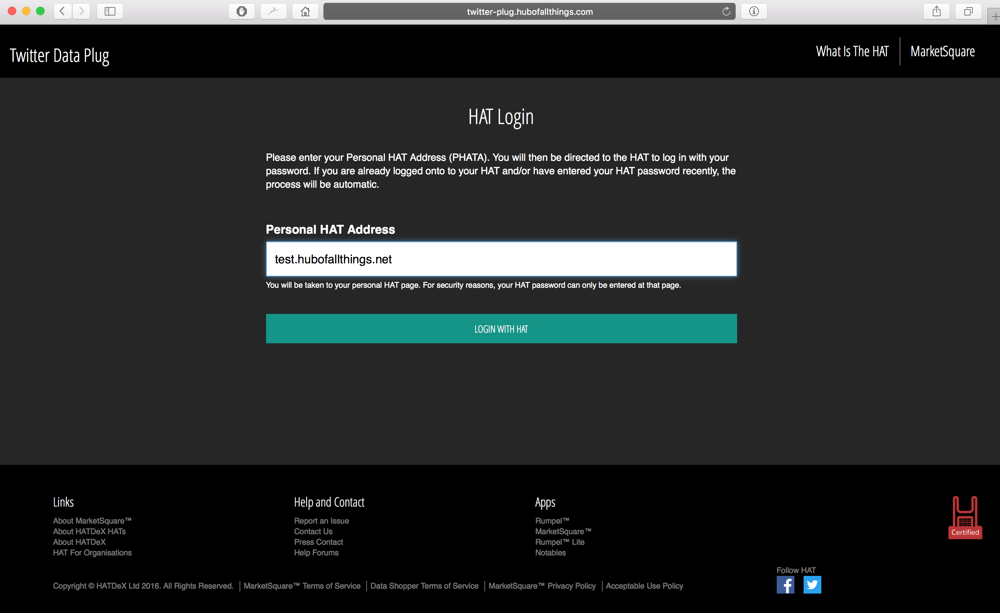

To log the user in with their HAT, you need to ask for their HAT address. Depending on the status of your app within the HAT ecosystem you may have also have a specific `application name` and an allower `redirect url` for the user to be sent to to complete authentication. If you do not have these details, you can put any `application name` and `rdirect url`, however the authentication token you will receive will not grant you any permissions to do any operations on the HAT but verify that the token really came from thet HAT.

To log the user in, you therefore send them to `https://<<HAT_NAME>>/hatlogin?name=<<APPLICATION_NAME>>&redirect=<<REDIRECT_URL>>` endpoint of the HAT, where:

- `<<HAT_NAME>>` is the (fully qualified domain) name of the HAT of oyur user
- `<<APPLICATION_NAME>>` is the name of your application as explained above
- `<<REDIRECT_URL>>` is the URL where the usr should be sent for completing authentication

If you redirect the user to an existing HAT, they will proceed to the next step.

<nav class="pager-nav">
<a href="./">Overview</a>
<a href="02-login-ui.html">Next step: User Logs in</a>
</nav>
